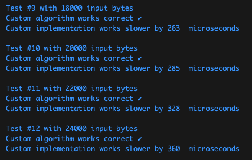

# DL_pw_5
Go implementation of SHA-1 hashing algorithm

## Requirements
```bash
* go ^1.19
```

## Installation 

1. Clone repository
```bash
git clone https://github.com/Ozu-bezariusu/DL_pw_5.git
```
```bash
cd DL_pw_5
```

2. Build and Run project
```bash
go build
```
```bash
./dl_pw_5
```

## Usage 
```bash
import (
	mysha1 "DL_pw_5/sha-1"
)

input := []byte("some text to hash")
sum := mysha1.Sum(input)
```

## Example

